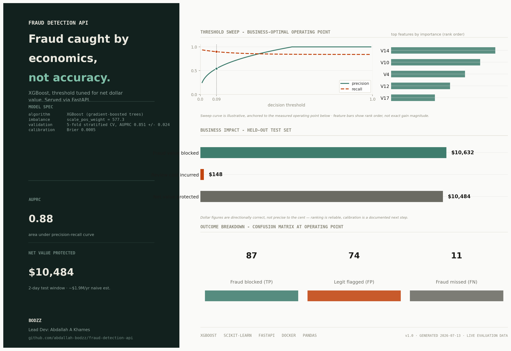
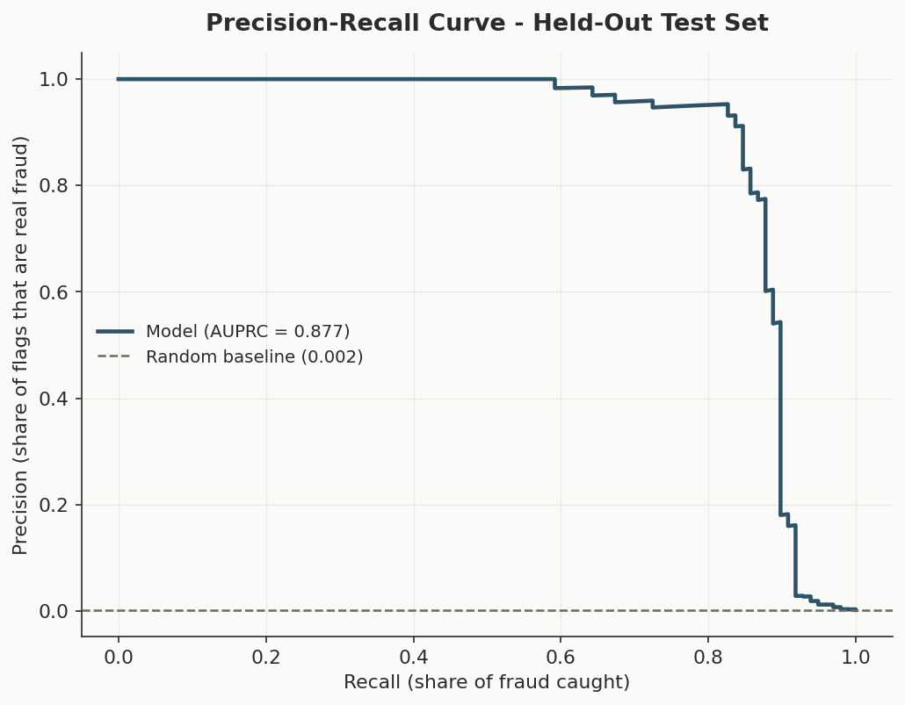
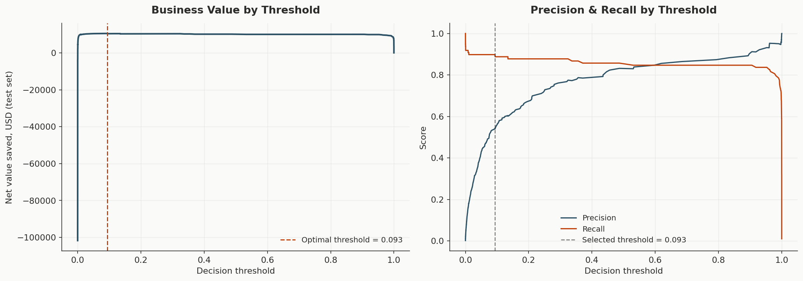
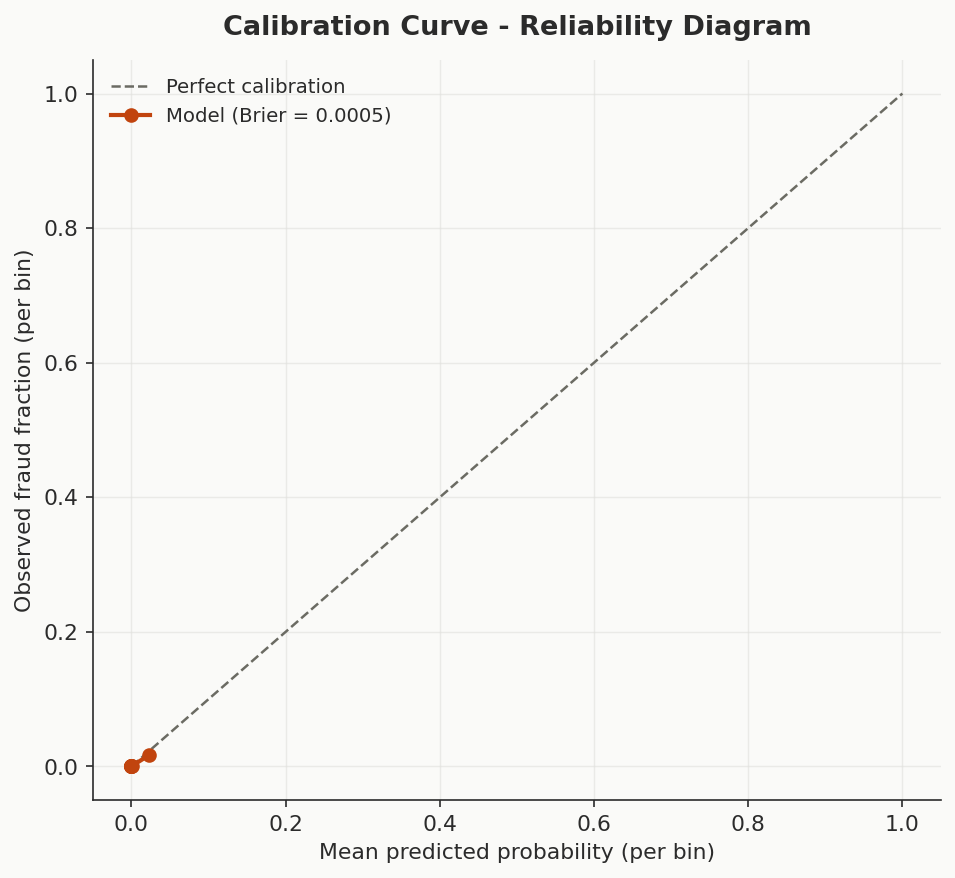
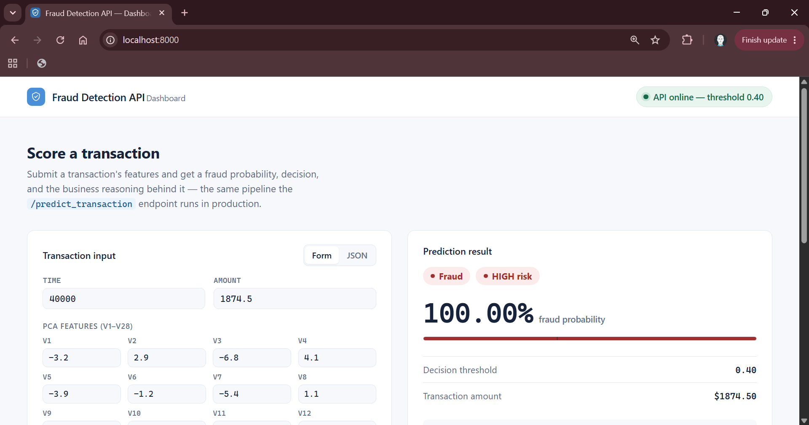
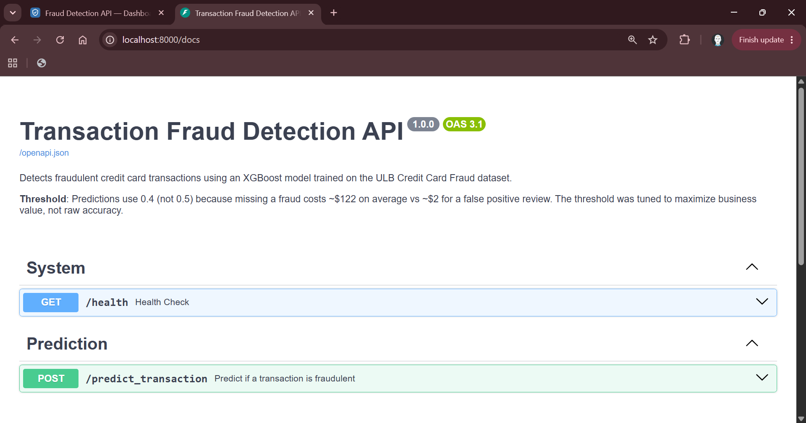
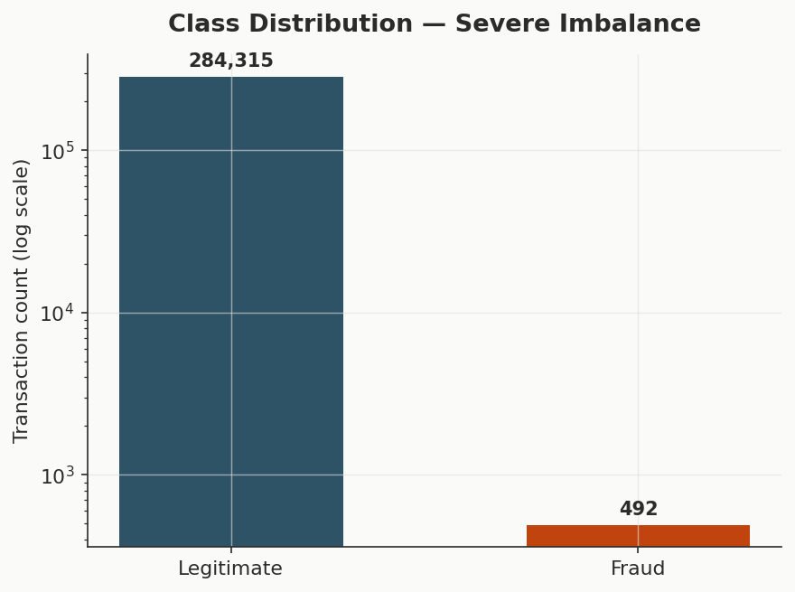
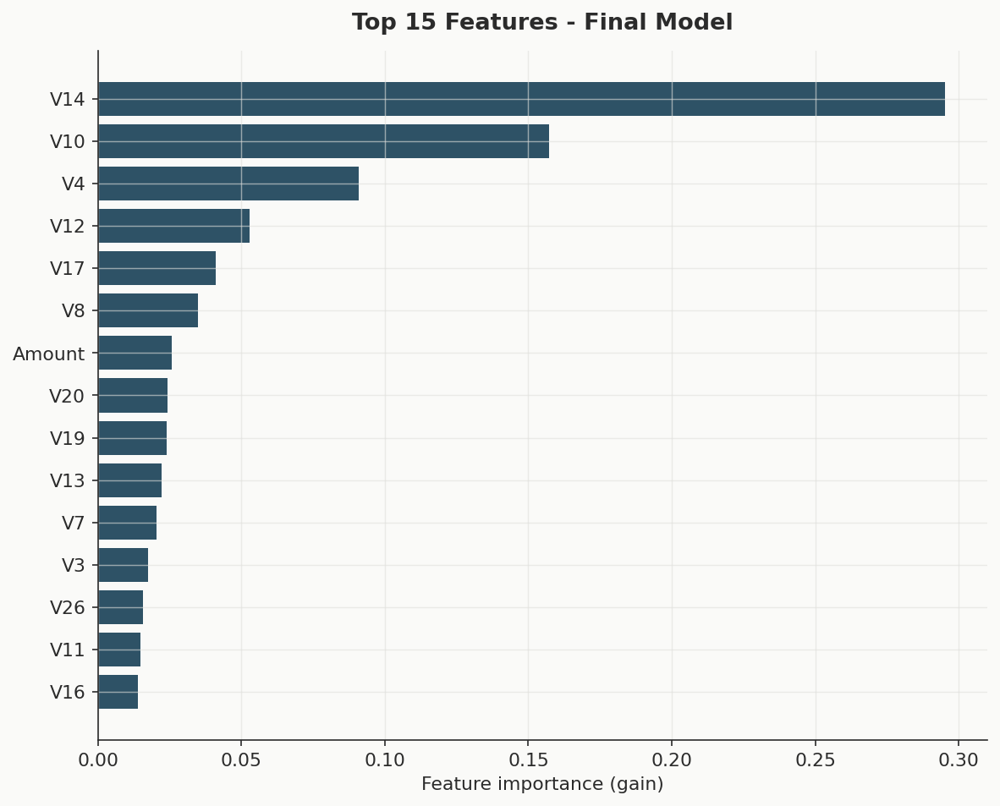

<div align="center">

# Fraud Detection API

**A production-grade fraud detection service built on a business-value objective, not raw accuracy.**

[](https://www.python.org)
[](https://fastapi.tiangolo.com)
[](https://xgboost.readthedocs.io/)
[](https://scikit-learn.org/)
[](https://www.docker.com)
[](tests/)
[](LICENSE)
[](https://github.com/abdallah-bodzz/fraud-detection-api/actions/workflows/ci.yml)
[](https://codecov.io/gh/abdallah-bodzz/fraud-detection-api)
[](https://github.com/astral-sh/ruff)

<br>



</div>

<br>

## Overview

Most fraud detection writeups stop at a notebook and an accuracy score, which is close to meaningless when 99.83% of transactions are legitimate. A classifier that predicts "legitimate" every time clears 99.8% accuracy and catches zero fraud.

This project treats fraud detection as a cost-minimization problem, not a classification benchmark. The model outputs a probability; the decision boundary on top of that probability is chosen by maximizing net dollar value, not F1 or accuracy. The result ships as a FastAPI service with request validation, rate limiting, structured logging, a branded operator dashboard, and a test suite — not just a `.ipynb` file.

**Dataset:** [ULB Credit Card Fraud Detection](https://www.kaggle.com/datasets/mlg-ulb/creditcardfraud) — 284,807 transactions, 492 fraud (0.173%).

<br>

## Table of Contents

- [Results](#results)
- [Architecture](#architecture)
- [Quickstart](#quickstart)
- [Dashboard](#dashboard)
- [API Reference](#api-reference)
- [Methodology](#methodology)
- [Repository Structure](#repository-structure)
- [Testing](#testing)
- [Design Decisions](#design-decisions--rationale)
- [Known Issues](#known-issues)
- [Roadmap](#roadmap)
- [License](#license)

<br>

## Results

Held-out test set, ~20% of the ~2-day transaction window. Pulled directly from `reports/evaluation_summary.json` — see [Known Issues](#known-issues) for a discrepancy this evaluation surfaced between the analysis and the currently shipped default threshold.

| Metric | Value | Notes |
|---|---|---|
| AUPRC | **0.877** | Primary metric — see [why AUPRC](#why-auprc-not-accuracy) |
| AUROC | 0.982 | Reported for reference, not as the headline |
| Precision @ threshold | 54.0% | Threshold = 0.093, selected by net business value |
| Recall @ threshold | 88.8% | |
| Net value protected | **$10,484** | Fraud blocked minus review cost, test set |
| Review cost incurred | $148 | 74 false positives at $2/review |
| Fraud value missed | $1,344 | 11 fraud cases below threshold |
| Cross-validation | 0.851 ± 0.024 AUPRC | 5-fold stratified, confirms the split wasn't a lucky draw |

<table>
<tr>
<td width="33%"></td>
<td width="33%"></td>
<td width="33%"></td>
</tr>
<tr>
<td align="center"><sub>Precision-recall curve</sub></td>
<td align="center"><sub>Business value by threshold</sub></td>
<td align="center"><sub>Probability calibration</sub></td>
</tr>
</table>

Full evaluation, including the calibration analysis and its caveats, lives in [`notebooks/03_evaluation.ipynb`](notebooks/03_evaluation.ipynb).

<br>

## Architecture

```
Client → FastAPI → Rate Limiter → Pydantic Validation → XGBoost Model → Business-Framed Response
   ↑                                                          ↓
   └── static/dashboard.html                       models/fraud_model.joblib
       (served at /, calls the API                  models/scaler.joblib
        exactly like any other client)
```

Single-process deployment, model loaded once at startup and held in memory for the process lifetime — no per-request disk reads. The service is stateless aside from the in-memory rate-limit window. The dashboard is a static asset with no build step; it talks to `/health` and `/predict_transaction` over plain `fetch()`, the same contract any external integrator uses.

<br>

## Quickstart

### Local

```bash
# 1. Get the data
# Download creditcard.csv from Kaggle, place it in data/

python -m venv venv
source venv/bin/activate          # Windows: venv\Scripts\activate
pip install -r requirements.txt

# 2. Train
python train_model.py

# 3. Serve
uvicorn src.main:app --reload
```

Dashboard at `http://localhost:8000/` · interactive API reference at `http://localhost:8000/docs`.

### Docker

```bash
docker compose up --build
```

Ships with a container healthcheck (`GET /health` on a 30s interval) so orchestrators can detect a stalled process without depending on `curl`, which the slim base image doesn't include.

<br>

## Dashboard

A branded, single-page operator console at `/` — submit a transaction, get a fraud probability, a colour-coded decision badge, and the business-framed reasoning behind it, without touching Swagger. Built as one dependency-free HTML file served as a static asset alongside the API, not a separate frontend deployment.

<table>
<tr>
<td width="50%"></td>
<td width="50%"></td>
</tr>
<tr>
<td align="center"><sub>Operator dashboard — form input, prediction result, session history</sub></td>
<td align="center"><sub>/docs — interactive OpenAPI reference, unchanged and fully intact</sub></td>
</tr>
</table>

**What it does, beyond a bare form:**

- **Dual input modes** — a guided form for all 30 features, or a raw JSON editor for anyone testing payloads directly; both stay in sync.
- **Session prediction history** — the last 5 predictions logged client-side, click one to reload it into the result panel without a re-fetch.
- **Live health polling** — the status pill in the top bar reflects `/health` in real time, including the active decision threshold.
- **Request latency, copy-as-JSON, and a `Ctrl`/`⌘`+`Enter` submit shortcut** — the kind of detail that makes this feel like a tool an engineer reaches for, not a demo.

The dashboard supplements `/docs`, it does not replace it — `GET /` is excluded from the OpenAPI schema, so API consumers integrating a client still get the untouched, schema-driven Swagger reference.

<br>

## API Reference

### `POST /predict_transaction`

Accepts all 30 features (`Time`, `V1`–`V28`, `Amount`) and returns a business-framed decision.

<details>
<summary><strong>Request / response example</strong></summary>

**Request**
```json
{
  "Time": 0.0,
  "V1": -1.3598, "V2": -0.0728, "V3": 2.5363, "V4": 1.3782,
  "V5": -0.3383, "V6": 0.4624, "V7": 0.2396, "V8": 0.0987,
  "V9": 0.3638, "V10": 0.0908, "V11": -0.5516, "V12": -0.6178,
  "V13": -0.9914, "V14": -0.3112, "V15": 1.4682, "V16": -0.4704,
  "V17": 0.2080, "V18": 0.0258, "V19": 0.4040, "V20": 0.2514,
  "V21": -0.0183, "V22": 0.2778, "V23": -0.1105, "V24": 0.0669,
  "V25": 0.1285, "V26": -0.1891, "V27": 0.1336, "V28": -0.0211,
  "Amount": 149.62
}
```

**Response**
```json
{
  "fraud_probability": 0.0014,
  "is_fraud": false,
  "threshold_used": 0.4,
  "risk_level": "LOW",
  "business_note": "Transaction approved. Fraud probability is 0.1% — below the 40% decision threshold...",
  "transaction_amount": 149.62
}
```

</details>

### `GET /health`

Liveness check — reports whether the model is loaded and the configured threshold. Polled by the dashboard's status pill every 20 seconds.

### `GET /`

Serves the operator dashboard. Excluded from the OpenAPI schema (`include_in_schema=False`) — a UI route, not part of the API contract.

### Rate limiting

60 requests/minute per client IP, in-memory sliding window. Documented as a single-process limitation — see [Design Decisions](#rate-limiting-in-memory-not-redis).

<br>

## Methodology

Full analysis and reasoning live in the notebooks; this is the short version.

### Why AUPRC, not accuracy

At a 1:577 fraud-to-legitimate ratio, accuracy is nearly uninformative — a model that never predicts fraud clears 99.8%. AUPRC (Average Precision) measures ranking quality on the minority class specifically, which is what this problem actually requires. AUROC is reported alongside it for context, since ROC curves look optimistic on imbalanced data due to the large true-negative pool.

### Why `scale_pos_weight`, not SMOTE

SMOTE constructs synthetic fraud examples by interpolating between real ones in feature space. In a PCA-projected space with no guarantee of local linearity, an interpolated point isn't guaranteed to represent a plausible fraud pattern. `scale_pos_weight` achieves the same loss-rebalancing effect by weighting the objective function directly, without fabricating data.

### Why the threshold is a business decision

The model's default 0.5 cutoff optimizes for a symmetric cost assumption that doesn't hold here: missing a fraud costs roughly $122 on average, a false alarm costs about $2 in review overhead. Sweeping the full threshold range against `(fraud caught × avg_fraud_amount) − (false alarms × review_cost)` on held-out data puts the optimum at **0.093**, not 0.5 and not the 0.4 currently hardcoded in `src/config.py` — see [Known Issues](#known-issues) for that gap and what it would take to close it.

<table>
<tr>
<td width="50%"></td>
<td width="50%"></td>
</tr>
<tr>
<td align="center"><sub>Class imbalance — 1 fraud per 577 legitimate transactions</sub></td>
<td align="center"><sub>Top model features, cross-checked against EDA separability</sub></td>
</tr>
</table>

| Notebook | Covers |
|---|---|
| [`01_eda.ipynb`](notebooks/01_eda.ipynb) | Class imbalance, amount/time distributions, PCA feature separability, data quality |
| [`02_model_training.ipynb`](notebooks/02_model_training.ipynb) | Baseline vs. XGBoost, hyperparameter search, feature importance, cross-validation |
| [`03_evaluation.ipynb`](notebooks/03_evaluation.ipynb) | AUPRC, calibration, threshold tuning, final business-impact numbers |

Each notebook is generated from a script (`generate_*_notebook.py`) rather than hand-edited — the structure is reviewable in a diff and reproducible from source control. `notebooks/_shared.py` holds the constants, canonical train/test split, and plot theme shared across all three, so a random seed or cost assumption can't silently drift between them.

<br>

## Repository Structure

```
fraud-detection-api/
├── src/                        API application
│   ├── main.py                   Routes, rate limiting, middleware, dashboard route
│   ├── model.py                  Model wrapper, prediction pipeline
│   ├── schemas.py                Pydantic request/response models
│   ├── config.py                 Environment-driven configuration
│   └── utils.py                  Structured logging (loguru)
│
├── static/
│   └── dashboard.html          Branded operator dashboard, served at /
│
├── tests/                      32 tests, real fixture model (no mocked predictions)
│   ├── conftest.py
│   ├── test_model.py
│   └── test_api.py
│
├── notebooks/                  Analysis, generated from source
│   ├── 01_eda.ipynb
│   ├── 02_model_training.ipynb
│   ├── 03_evaluation.ipynb
│   ├── _shared.py                Constants, canonical split, plot theme
│   └── temp/                     generate_*_notebook.py source scripts
│
├── reports/                    Exported findings, figures, and screenshots
│   ├── figures/                   12 analysis charts + hero_visual.png
│   ├── screenshots/                Dashboard, Swagger UI, terminal captures
│   ├── eda_summary.json
│   ├── model_training_summary.json
│   └── evaluation_summary.json
│
├── models/                      Trained artifacts (fraud_model.joblib, scaler.joblib)
├── train_model.py               Standalone training entry point
├── generate_hero_visual.py      README hero banner generator
├── Dockerfile / docker-compose.yml
├── pyproject.toml               Ruff + pytest configuration
└── requirements.txt
```

<br>

## Testing

```bash
pytest
```

```
=============================== 32 passed in 5.24s ===============================
```

Tests train a small, real XGBoost model on synthetic data rather than mocking `predict_proba()` — a mocked model can't catch a broken feature order or a misaligned scaler column, which is the failure mode most likely to slip through review undetected. Coverage includes artifact loading and its failure modes, prediction schema and probability bounds, threshold-driven classification consistency, request validation, rate limiting, the 503 path when the model isn't ready, and that the dashboard route stays excluded from the OpenAPI schema while `/docs` keeps working untouched.

<br>

## Design Decisions & Rationale

| Decision | Rationale |
|---|---|
| **XGBoost over a neural network** | 30 numeric features, no missing values, no sequential structure — gradient-boosted trees match or exceed NN performance here while training faster and producing inspectable feature importances. |
| **Only `Time` and `Amount` scaled** | `V1`–`V28` are already-normalized PCA output; scaling them again would distort that structure. |
| **AUPRC as the primary metric** | See [Methodology](#why-auprc-not-accuracy). |
| <a name="rate-limiting-in-memory-not-redis"></a>**Rate limiting: in-memory, not Redis** | A single-process sliding window is sufficient for this deployment scale and keeps the stack dependency-free. Documented limitation: this does not hold across multiple workers or replicas — see [Roadmap](#roadmap). |
| **Config paths resolve against `__file__`, not CWD** | `uvicorn src.main:app` behaves identically whether launched from the project root, a CI runner, or a container `WORKDIR`. |
| **Dashboard supplements `/docs`, doesn't replace it** | Integrators generating clients still need the schema-driven Swagger reference; the dashboard is a UI convenience layered on top, not a substitute for the API contract. |

<br>

## Known Issues

Tracked discrepancies between the analysis notebooks and what's currently shipped, documented here rather than quietly patched over, so the gap between "what the data says" and "what's deployed" stays visible.

| Issue | Detail | Fix |
|---|---|---|
| **Shipped threshold doesn't match the business-value analysis** | `src/config.py` hardcodes `PREDICTION_THRESHOLD = 0.4`, with a docstring quoting ~88% recall / ~87% precision at that value. `03_evaluation.ipynb`'s actual sweep puts the net-value-maximizing threshold at **0.093** (54.0% precision, 88.8% recall, $10,484 net value on the test set) — a materially different operating point. Either the config default is stale from an earlier model version, or the comment was never updated after a later evaluation run. | Re-run the threshold sweep against the currently saved model, then update `PREDICTION_THRESHOLD` and its docstring together so the two can't drift again. |
| **Hyperparameter-search verdict logic compares two different splits** | In `02_model_training.ipynb` (Cell 9), the branch that decides whether to keep the hand-tuned model or adopt the searched one compares the search's 3-fold **training-CV** AUPRC (0.846) against the hand-tuned model's **held-out test** AUPRC (0.867) — not an apples-to-apples comparison — and its printed message labels the resulting negative delta as "materially better," which reads backwards. The searched configuration was still saved and independently validated in `03_evaluation.ipynb` (test AUPRC 0.877), so production performance isn't in question, but the decision rationale recorded in the notebook is currently mislabeled. | Compare CV-vs-CV or test-vs-test, not CV-vs-test, and fix the message so a negative delta is reported as negative. |

<br>

## Roadmap

Scoped as genuine next steps for a multi-instance production deployment, not filler:

- **Redis-backed rate limiting** — required once the service runs across more than one worker or replica; the current in-memory store is correctly scoped to single-process deployments and documented as such above.
- **Probability calibration** (`CalibratedClassifierCV`) — the calibration curve in `03_evaluation.ipynb` shows the model's ranking is reliable but its raw probabilities skew as gradient-boosted trees typically do; Platt scaling or isotonic regression would tighten the dollar-cost threshold calculation.
- **Batch prediction endpoint** — `POST /predict_batch` for bulk scoring workloads, with a matching bulk-upload mode in the dashboard.
- **Drift monitoring** — fraud patterns are non-stationary; a production deployment needs to track prediction-distribution drift over time, not just serve a static threshold indefinitely.
- **API key authentication** — the endpoint is currently open; a minimal `X-API-Key` header check is a bounded, low-effort addition before any public deployment.

<br>

## License

MIT — see [LICENSE](LICENSE).

<br>

---

<div align="center">

**Fraud Detection API** · Built by **Abdallah A Khames** · [BODZZ](https://github.com/abdallah-bodzz)

[github.com/abdallah-bodzz/fraud-detection-api](https://github.com/abdallah-bodzz/fraud-detection-api)

</div>